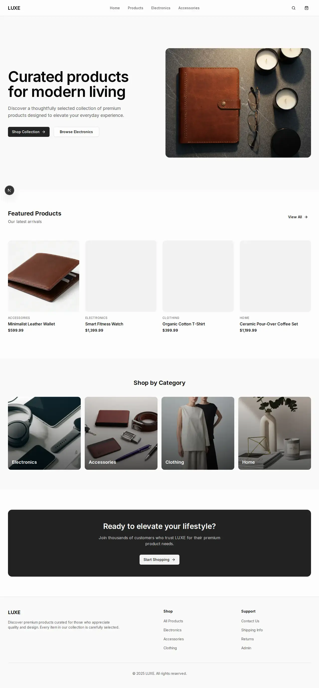
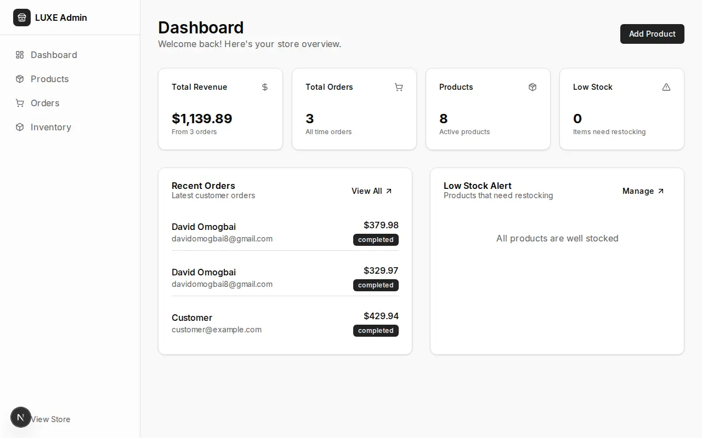

# Luxe

A modern, responsive E-commerce application built with Next.js 16, React 19, TypeScript, Tailwind CSS, Shadcn UI, and Supabase.

## Features

- **Storefront**: Browse products, view details, and add to cart.
- **Cart Management**: Add, remove, and update items in the cart (via a drawer).
- **Checkout**: Secure checkout process integrated with Stripe.
- **Admin Dashboard**: Manage products and view orders.
- **Responsive Design**: Mobile-friendly interface using Tailwind CSS.
- **Error Handling**: Custom error pages and loading states.

## Tech Stack

- **Framework**: [Next.js 16](https://nextjs.org/) (App Router)
- **Library**: [React 19](https://react.dev/)
- **Language**: [TypeScript](https://www.typescriptlang.org/)
- **Styling**: [Tailwind CSS 4](https://tailwindcss.com/)
- **Components**: [Shadcn UI](https://ui.shadcn.com/) (Radix UI)
- **Backend**: [Supabase](https://supabase.com/)
- **Payments**: [Stripe](https://stripe.com/)
- **Icons**: [Lucide React](https://lucide.dev/)
- **Forms**: [React Hook Form](https://react-hook-form.com/) + [Zod](https://zod.dev/)

## Screenshots

### Home Page


### Admin Dashboard


## Setup Instructions

### Prerequisites

- Node.js 18+ and pnpm (or npm/yarn/bun)
- A Supabase account and project
- A Stripe account (for payments)

### 1. Clone the repository

```bash
git clone https://github.com/iamgatling/Luxe.git
cd luxe
```

### 2. Install dependencies

```bash
pnpm install
# or
npm install
# or
yarn install
# or
bun install
```

### 3. Environment Variables

Create a `.env` file in the root directory by copying `.env.example`:

```bash
cp .env.example .env
```

Update `.env` with your actual credentials:

```env
# Stripe Configuration
NEXT_PUBLIC_STRIPE_PUBLISHABLE_KEY="pk_test_..."
STRIPE_SECRET_KEY="sk_test_..."

# Supabase Configuration
NEXT_PUBLIC_SUPABASE_URL="https://your-project-ref.supabase.co"
NEXT_PUBLIC_SUPABASE_ANON_KEY="your_public_anon_key"
SUPABASE_SERVICE_ROLE_KEY="your_service_role_key"
```

### 4. Database Setup (Supabase)

1.  **Create a new project** on Supabase.
2.  **Go to the SQL Editor** in your Supabase dashboard.
3.  **Run the SQL query `create-tables.sql` in scripts/** to set up the necessary tables (adjust based on your actual schema requirements).
4.  **Populate data**: You can insert some dummy data into the `products` table by Running the SQL query `seed-products.sql` in script/ (adjust based on your actual schema requirements).

### 5. Run the development server

```bash
pnpm dev
# or
npm run dev
```

Open [http://localhost:3000](http://localhost:3000) with your browser to see the result.

## Project Structure

- `app/`: Next.js App Router pages and layouts.
  - `(store)/`: Main storefront pages.
  - `admin/`: Admin dashboard pages.
- `components/`: Reusable UI components.
  - `ui/`: Shadcn UI primitives.
  - `store/`: Store-specific components (Header, Footer, etc.).
- `lib/`: Utility functions and configurations (Stripe, Supabase, Utils).
- `public/`: Static assets.

## Deploy

This project is optimized for [Vercel](https://vercel.com) and uses Vercel Analytics.

The easiest way to deploy is to create a copy of the repository in your GitHub account and set up the project on Vercel.


> **Note:** If you choose to deploy on another platform (Netlify, Docker, etc.), you must remove the `<Analytics />` component from `app/layout.tsx` to avoid build errors.